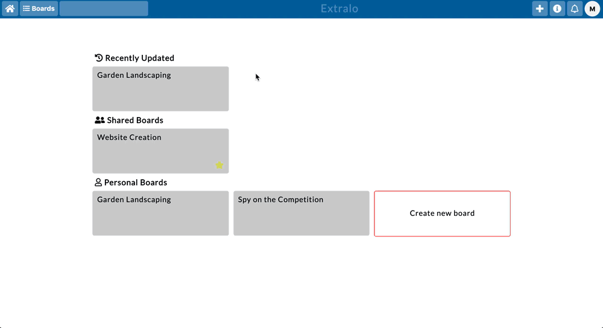

# extralo
[Live Demo](https://extralo.herokuapp.com)


---
## About
*"If you can see it, you can edit"*

Extralo is a project-management app that helps users organize their workflow. With simple styling, intuitive controls, and a core philosophy of **"Organize just enough to do it"** , Extralo stays out of the way of what actually matters - getting work done.


## Features

The main organizational unit in Extralo is a **Board**. Boards can contain an arbitrary amount of **Lists**, which in turn can contain an arbitrary amount of **Cards**. There are no restrictions imposed on the internal structure of a Board, allowing the user to decide how they want to organize the structure of their project.

Users can rearrange cards within lists and across lists, as well as rearrange the lists themselves. This provides an intuitive interface and leaves the specifics of a project's workflow entirely up to the user.



The visual rendering and reordering of the drag-and-drop feature is powered by react-beautiful-dnd. However, react-beautiful-dnd only handles visual logic and reordering - persisting changes to the database required creating custom backend logic.

Since there is no upper limit for the number of cards or lists a user might create per board, redefining each item's order would be an O(n) process, potentially slowing down the performance of the app beyond what's reasonably useful. To solve this issue, Extralo uses a custom built linked-list structure, reducing the time complexity of item reordering to O(1) and thus ensuring that a user is free to create as many cards and lists as they require without slowing down the app.

When a user drags a card/list to a new position, Extralo sends an AJAX request to the backend with the information of which item moved, and who it's new parent and child are. Both the Card and List models have methods that take this information and "rearrange" the list order within the database - allowing the visual reordering that the user sees to persist to the database.

```ruby
    def insertBetween(new_parent = "sentinel", new_child = "sentinel")
        # if this is called without passing any arguements,
        # it effectively deletes the node from the list
        # and correctly updates the surrounding nodes

        # if a card has been moved to the edge of a list then
        # instantiate sentinel cards to make the rest of the reordering logic consistent
        new_parent = Card.new() if new_parent == "sentinel" 
        new_child = Card.new() if new_child == "sentinel"

        old_parent = self.parent
        old_child = self.child
        old_parent.next_id = old_child.id
        old_child.prev_id = old_parent.id
 
        new_child.prev_id = self.id
        new_parent.next_id = self.id

        # handle edge case where old_parent == new_child (swap)
        if old_parent.id == new_child.id
            old_parent.next_id = self.next_id
            new_child.next_id = self.next_id
            old_parent.prev_id = self.id
            new_child.prev_id = self.id
        end
        if new_parent.id == old_child.id
            new_parent.prev_id = self.prev_id
            old_child.prev_id = self.prev_id
            new_parent.next_id = self.id
            old_child.next_id = self.id
        end

        self.next_id = new_child.id
        self.prev_id = new_parent.id

        # succesfully save everything at once, or not at all
        # ignore saving sentinel objects to the database
        Card.transaction do 
            old_parent.save! if old_parent.id
            old_child.save! if old_child.id
            newSelf = Card.update(self.id, self.attributes)
            new_parent.save! if new_parent.id
            new_child.save! if new_child.id
        end

        # returns an array of all the nodes that were changed so the redux state can update
        return [
            self,
            old_child,
            old_parent,
            new_parent,
            new_child,
        ].reject {|card| card.id == nil}
    end
```

The above code handles much of the logic involved with moving nodes within a linked-list, and when called without any specified parent/child nodes, the method removes a node from an existing linked-list, giving the method a high-degree of flexibility and reusability.